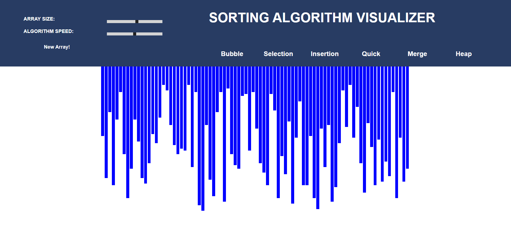
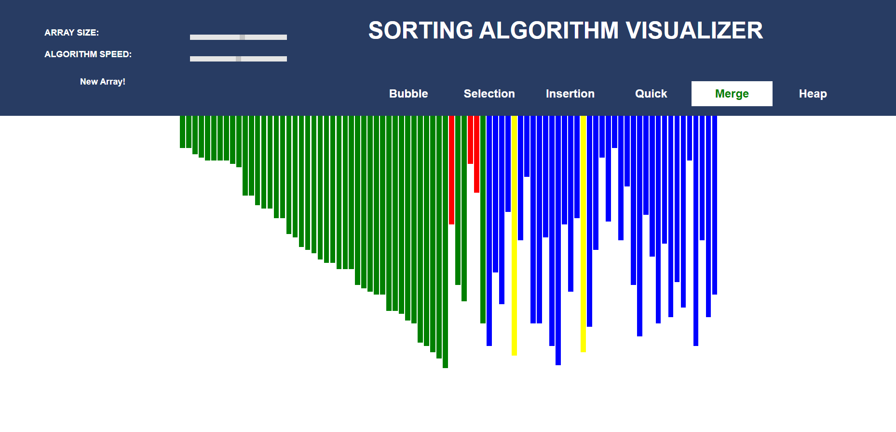
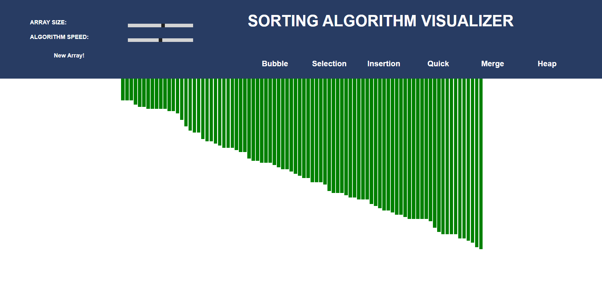

# Sorting-Algorithm-Visualizer
This is a Web Visualization tool for sorting algorithms.

The human brain can easily process visuals instead of long codes to understand the algorithms.

## Approach
* An array of random values is generated and are drawn as lines(bars).
* You can increse/decrease the size of the array and the speed of the algorithms.
* Different colors are used to indicate which elements being compared, sorted and unsorted.
* New array can be generated by clicking the "New Array" button.

### Initial

### Visualizing

### Final

## Sorting Algorithms Visualized

* [Bubble Sort](https://www.geeksforgeeks.org/bubble-sort/)
* [Selection Sort](https://www.geeksforgeeks.org/selection-sort/)
* [Insertion Sort](https://www.geeksforgeeks.org/insertion-sort/)
* [Quick Sort](https://www.geeksforgeeks.org/quick-sort/)
* [Merge Sort](https://www.geeksforgeeks.org/merge-sort/)
* [Heap Sort](https://www.geeksforgeeks.org/heap-sort/)
